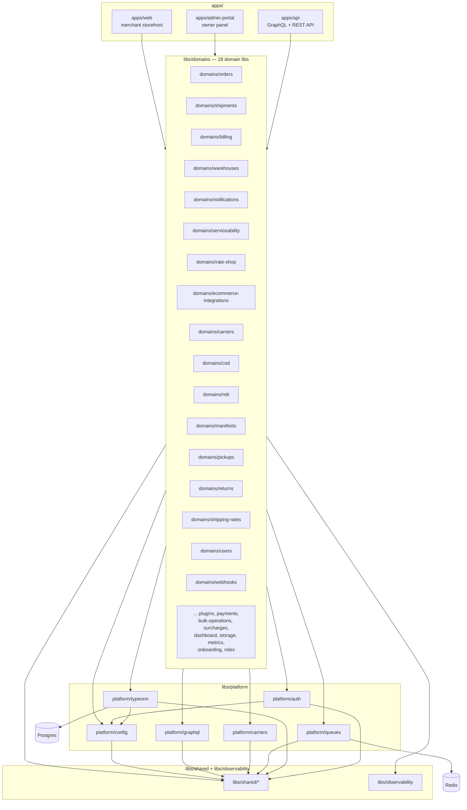

# Architecture

> One-page reference for the SwiftShip AI Nx monorepo. For the in-flight
> Prisma → TypeORM migration, see [`MIGRATION.md`](./MIGRATION.md).

## Lib layers

```
apps/         ← entry points (the only things that wire everything together)
libs/domains/ ← business capabilities (one lib per bounded context)
libs/platform/← infrastructure: auth, typeorm, queues, carriers, graphql, config
libs/shared/  ← cross-cutting types, utils, DTO fragments
libs/observability/ ← logger, metrics, tracing
```

The arrows in the diagram below are the only legal dependency directions.
A lib may only import from layers to its right (or its own type).



## The 3 apps

| App | Path | What it does |
| --- | --- | --- |
| **`api`** | `apps/api/` | The NestJS GraphQL + REST API. Owns auth, carriers, orders, billing, webhooks, and the GraphQL schema. This is where the bulk of the backend lives. |
| **`admin-portal`** | `apps/admin-portal/` | The Next.js owner/operator panel. Internal tooling for SwiftShip staff (tenant management, support, finance). |
| **`web`** | `apps/web/` | The Next.js merchant storefront. Customer-facing UI for sellers using SwiftShip as their shipping partner. |

## The 6 platform libs (`libs/platform/`)

| Lib | Path | What it does |
| --- | --- | --- |
| `platform/auth` | `libs/platform/auth/` | Passport JWT strategy, refresh tokens, `@CurrentUser` / `@Roles` decorators, GraphQL guards. |
| `platform/typeorm` | `libs/platform/typeorm/` | The `TypeOrmModule`, the entity files, the `DataSource`, and the in-flight `PrismaCompat` shim (see `MIGRATION.md`). |
| `platform/queues` | `libs/platform/queues/` | BullMQ wrapper on `ioredis` (`QueuesService`, `getQueue`, `createWorker`). |
| `platform/carriers` | `libs/platform/carriers/` | The `CarrierAdapter` interface and the adapter registry (`carrier-adapter.service.ts`) that wires `Delhivery`, `BlueDart`, `Xpressbees`, etc. |
| `platform/graphql` | `libs/platform/graphql/` | Apollo driver wiring, code-first schema generation, throttler, and shared GraphQL decorators. |
| `platform/config` | `libs/platform/config/` | Joi-validated `ConfigModule` and the `env` accessor used by every other lib. |

## The 18 domain libs (`libs/domains/`)

Each domain lib is a self-contained NestJS feature module (resolver, service,
entities, models, inputs, specs). The 18:

1. `domains/orders` — order intake, manifest assignment, lifecycle.
2. `domains/shipments` — shipment records, label lifecycle, tracking.
3. `domains/billing` — invoices, wallet, credit notes.
4. `domains/warehouses` — warehouse CRUD, inventory.
5. `domains/notifications` — email/SMS/WhatsApp dispatch.
6. `domains/serviceability` — pincode → carrier matrix.
7. `domains/rate-shop` — multi-carrier rate shopping.
8. `domains/ecommerce-integrations` — Shopify + WooCommerce adapters.
9. `domains/carriers` — carrier accounts and credential management.
10. `domains/cod` — COD remittance and reconciliation.
11. `domains/ndr` — non-delivery report handling.
12. `domains/manifests` — daily manifests and handover.
13. `domains/pickups` — pickup scheduling and tracking.
14. `domains/returns` — return-to-origin flows.
15. `domains/shipping-rates` — rate cards and zone pricing.
16. `domains/users` — users and tenants.
17. `domains/webhooks` — outbound webhook delivery (queued).
18. `domains/payments` — Stripe + Razorpay integration.

> The directory actually has 25 entries (it also includes `plugins`,
> `bulk-operations`, `surcharges`, `dashboard`, `storage`, `metrics`,
> `onboarding`, and `roles`). The 18 listed above are the bounded contexts
> that the architecture and migration plans treat as "first-class"; the rest
> are capability libs that the apps wire in alongside the domains.

## Shared and observability libs

| Lib | Path | What it does |
| --- | --- | --- |
| `shared/*` | `libs/shared/` | Cross-cutting types, DTO fragments, money helpers, country/currency tables, validation utilities. Imported by both `platform` and `domains`. |
| `observability` | `libs/observability/` | Structured logger, Prometheus-style metrics, request tracing, audit log. The only place cross-cutting telemetry is defined. |

## The 5 architectural rules

1. **No cycles between libs.** The Nx `@nx/enforce-module-boundaries` rule
   in `eslint.config.cjs` is the enforcement. If a circular dep is
   required, the boundary is wrong — split the lib.
2. **Platform libs can only depend on other platform libs** (plus
   `shared` and `type:types`). Platform libs must not import from
   `domains/`. That keeps infrastructure reusable across multiple
   business domains.
3. **Domain libs can only depend on platform + their own type.** A
   `domains/orders` service may inject `@InjectRepository(Order)` and
   call `QueuesService`, but it must not reach into `domains/billing`
   directly — it goes through that lib's public API or an event.
4. **Apps are the only things that wire everything together.** The
   domain and platform libs are inert on their own. Composition
   (module imports, `TypeOrmModule.forFeature`, GraphQL resolver
   registration) lives in `apps/api/src/app.module.ts`,
   `apps/admin-portal/app/`, and `apps/web/app/`. This is what makes
   the same domain lib reusable from more than one app.
5. **Cross-cutting concerns (logger, metrics) live in
   `libs/observability`.** No domain or platform lib should `console.log`
   or instantiate its own `Counter`. They import the observability
   primitives; the wire-up (Prometheus registry, OTLP exporter) happens
   once in the apps.
