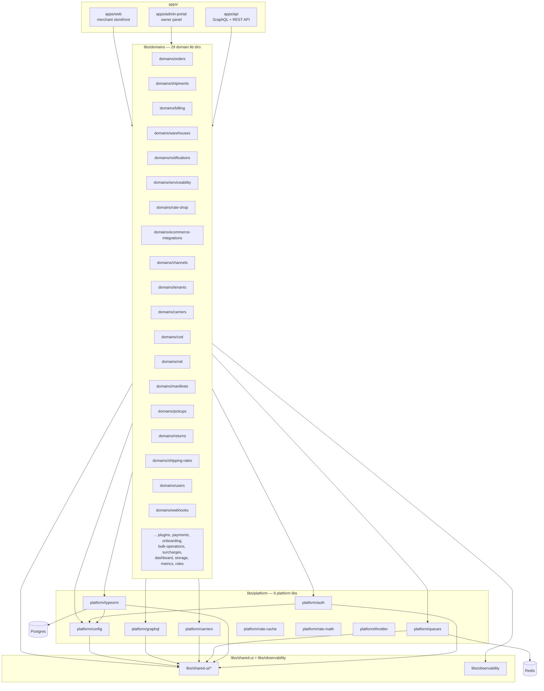

# Architecture

> One-page reference for the SwiftShip AI Nx monorepo. The Prisma → TypeORM
> migration is **complete** — [`MIGRATION.md`](./MIGRATION.md) now covers the
> TypeORM conventions and the remaining legacy `src/` decommission. For the
> current state of the tree (including known breakages), see
> [`STATUS.md`](./STATUS.md).

## Lib layers

```
apps/         ← entry points (the only things that wire everything together)
libs/domains/ ← business capabilities (one lib per bounded context)
libs/platform/← infrastructure: auth, typeorm, queues, carriers, graphql, config,
                rate-cache, rate-math, throttler
libs/shared-ui/ ← cross-app formatting helpers (cn, formatINR, formatDate)
libs/observability/ ← OTel, Sentry, audit log, correlation IDs, logger, metrics
packages/     ← generated SDKs (node, python, php) from the OpenAPI spec
```

The arrows in the diagram below are the only legal dependency directions.
A lib may only import from layers to its right (or its own type).



## The 5 apps

| App | Path | What it does |
| --- | --- | --- |
| **`api`** | `apps/api/` | The NestJS GraphQL + REST core API. Wires every domain + platform lib, KYC, GST/E-way, COD remittance, channel sync, observability, and the tenant guard. |
| **`api-public`** | `apps/api-public/` | The public, versioned REST API (tsoa): 8 controllers, API-key auth, per-tenant throttling, Swagger UI at `/docs/v1/`, committed OpenAPI spec — the contract the SDKs are generated from. |
| **`admin-portal`** | `apps/admin-portal/` | The Next.js owner/operator console (PWA): dashboard, NDR analytics, orders, channel management, rate-shop widget. |
| **`web`** | `apps/web/` | The Next.js customer-facing surfaces: branded tracking page, end-customer return portal, embeddable CDN widgets. |
| **`api-e2e`** | `apps/api-e2e/` | Supertest e2e suite that boots the full `AppModule` against Postgres + Redis. |

## The 9 platform libs (`libs/platform/`)

| Lib | Path | What it does |
| --- | --- | --- |
| `platform/auth` | `libs/platform/auth/` | Passport JWT strategy, refresh tokens, `@CurrentUser` / `@Roles` decorators, GraphQL guards. |
| `platform/typeorm` | `libs/platform/typeorm/` | The `TypeOrmModule`, entity files, `DataSource`, and the 16 TypeORM migrations. The only ORM — Prisma is gone. |
| `platform/queues` | `libs/platform/queues/` | BullMQ wrapper on `ioredis` (`QueuesService`, `getQueue`, `createWorker`) + webhook dispatcher. |
| `platform/carriers` | `libs/platform/carriers/` | The `CarrierAdapter` interface and the adapter registry wiring 13 carriers (Delhivery, BlueDart, DTDC, Ecom Express, Xpressbees, Shadowfax, Aramex, DHL, FedEx India, Gati, India Post, Professional Couriers) + sandbox. |
| `platform/graphql` | `libs/platform/graphql/` | Apollo driver wiring, code-first schema generation, throttler, and shared GraphQL decorators. |
| `platform/config` | `libs/platform/config/` | Joi-validated `ConfigModule` and the `env` accessor used by every other lib. |
| `platform/rate-cache` | `libs/platform/rate-cache/` | Redis-backed rate cache, per-carrier circuit breaker, prewarm support. |
| `platform/rate-math` | `libs/platform/rate-math/` | Weight-break slabs, zone resolution, fuel/ODA/COD/insurance surcharges + fuel-index scheduler. |
| `platform/throttler` | `libs/platform/throttler/` | Postgres-backed throttler storage + `TenantThrottlerGuard` (per-tier buckets, quota headers). |

## The 29 domain lib dirs (`libs/domains/`)

Each domain lib is a self-contained NestJS feature module (resolver, service,
entities, models, inputs, specs). The first-class bounded contexts:

1. `domains/orders` — order intake, manifest assignment, lifecycle.
2. `domains/shipments` — shipment records, label lifecycle, tracking.
3. `domains/billing` — invoices, wallet, credit notes **+ GST/E-way (ClearTax adapter) + COD remittance/reconciliation (5 bank parsers) + dispute queue**.
4. `domains/warehouses` — warehouse CRUD, inventory.
5. `domains/notifications` — email/SMS/WhatsApp dispatch (Exotel + WATI).
6. `domains/serviceability` — pincode → carrier matrix.
7. `domains/rate-shop` — multi-carrier rate shopping **+ ranking engine + A/B simulator**.
8. `domains/ecommerce-integrations` — Shopify + WooCommerce adapters.
9. `domains/channels` — **channel-agnostic sync stack**: `ChannelSyncService`, credential cipher, per-channel adapters (Shopify, WooCommerce, Amazon, Flipkart, Myntra, Meesho) + auth services.
10. `domains/tenants` — tenant context/guard/middleware, wallet, sub-accounts, API keys, feature flags.
11. `domains/carriers` — carrier accounts and credential management.
12. `domains/cod` — COD remittance and reconciliation.
13. `domains/ndr` — non-delivery report handling **+ analytics (reason/pincode/courier/time-of-day breakdowns)**.
14. `domains/manifests` — daily manifests and handover.
15. `domains/pickups` — pickup scheduling and tracking.
16. `domains/returns` — return-to-origin flows.
17. `domains/shipping-rates` — rate cards and zone pricing.
18. `domains/users` — users and roles.
19. `domains/webhooks` — outbound webhook delivery (queued).
20. `domains/payments` — Stripe + Razorpay integration.
21. `domains/onboarding` — onboarding milestones **+ KYC (PAN/GSTIN/bank validators, async verify)**.

> Plus the capability libs: `plugins`, `bulk-operations`, `surcharges`,
> `dashboard`, `storage`, `metrics`, `roles` — 29 directories in total.
>
> **Migration note:** a handful of these (`carriers`, `returns`, `roles`,
> `serviceability`, `shipping-rates` are placeholder barrels; ~10 libs still
> re-export the legacy root `src/` tree through their barrels). The legacy
> `src/` decommission is the remaining cleanup — see
> [`MIGRATION.md`](./MIGRATION.md#9-the-remaining-src-to-libs-decommission) and
> [`STATUS.md`](./STATUS.md#3-the-half-finished-src-to-libs-decommission).

## Shared and observability libs

| Lib | Path | What it does |
| --- | --- | --- |
| `shared-ui` | `libs/shared-ui/` | `cn()`, `formatINR()`, `formatDate()` — used by both Next apps. (`libs/shared/` exists in the path map but is currently empty — do not add to it; see STATUS.md.) |
| `observability` | `libs/observability/` | `StructuredLogger`, Prometheus `/metrics`, correlation IDs, OTel tracing bootstrap, Sentry filter/interceptor, and the `@Auditable()` audit log. The only place cross-cutting telemetry is defined. |
| `packages/*` | `packages/node, python, php` | Official SDKs generated from the `api-public` OpenAPI spec by `scripts/build-sdks.mjs` (CI: `sdk-ci.yml`). |

## The 5 architectural rules

1. **No cycles between libs.** The Nx `@nx/enforce-module-boundaries` rule
   in `eslint.config.cjs` is the enforcement. If a circular dep is
   required, the boundary is wrong — split the lib.
2. **Platform libs can only depend on other platform libs** (plus
   `shared` and `type:types`). Platform libs must not import from
   `domains/`. That keeps infrastructure reusable across multiple
   business domains.
3. **Domain libs can only depend on platform + their own type.** A
   `domains/orders` service may inject `@InjectRepository(Order)` and
   call `QueuesService`, but it must not reach into `domains/billing`
   directly — it goes through that lib's public API or an event.
4. **Apps are the only things that wire everything together.** The
   domain and platform libs are inert on their own. Composition
   (module imports, `TypeOrmModule.forFeature`, GraphQL resolver
   registration) lives in `apps/api/src/app.module.ts`,
   `apps/admin-portal/app/`, and `apps/web/app/`. This is what makes
   the same domain lib reusable from more than one app.
5. **Cross-cutting concerns (logger, metrics) live in
   `libs/observability`.** No domain or platform lib should `console.log`
   or instantiate its own `Counter`. They import the observability
   primitives; the wire-up (Prometheus registry, OTLP exporter) happens
   once in the apps.
