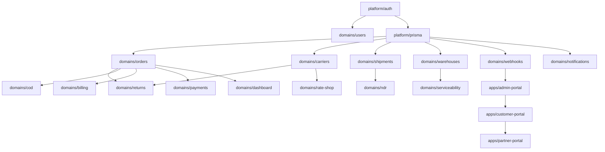

# Nx Monorepo Migration Design

**Date:** 2026-06-12
**Status:** Approved
**Author:** Claude (Brainstorming session with user)

## Overview

Convert the SwiftShip AI NestJS backend into an enterprise-grade Nx monorepo with three Next.js frontends (admin, customer, partner portals), enabling team organization, code generators, and shared code reuse at scale.

## Goals

1. **Team organization** - Clear ownership boundaries across 15+ developers
2. **Code generators** - Nx generators for scaffolding new domains in seconds
3. **Shared code reuse** - 70-80% code sharing between frontends
4. **Enterprise scalability** - Enforced boundaries, performance budgets, zero-downtime migration
5. **Developer experience** - Fast builds, incremental testing, clear dependency graph

## Workspace Architecture

### Top-Level Structure

```
swiftship-monorepo/
├── apps/                              # Deployables (what you ship)
│   ├── api/                           # NestJS GraphQL API (port 3000)
│   ├── admin-portal/                  # Next.js admin panel (port 4200)
│   ├── customer-portal/               # Next.js customer dashboard (port 4300)
│   └── partner-portal/                # Next.js partner integrations (port 4400)
│
├── libs/                              # Importable libraries
│   ├── domains/                       # Business domains (vertical slices)
│   ├── shared/                        # Cross-cutting, product-specific
│   └── platform/                      # Infrastructure (rarely changes)
│
├── tools/                             # Nx generators, executors, scripts
├── docs/                              # Documentation
├── nx.json                            # Nx configuration
├── tsconfig.base.json                 # Shared TS config with path mappings
└── package.json                       # Root package.json
```

### Library Organization (Hybrid Approach)

**`libs/domains/`** - Business domains as vertical slices:
- `<domain>/types` - GraphQL types, DTOs, enums
- `<domain>/data-access` - Prisma queries, repository pattern
- `<domain>/api` - NestJS resolvers + services (API only)
- `<domain>/ui` - React components, hooks (frontends only)

**`libs/shared/`** - Cross-cutting, product-specific:
- `ui` - Design system, common components
- `utils` - Validators, formatters, helpers
- `graphql` - Apollo client setup, codegen config
- `types` - Shared TypeScript types
- `constants` - App-wide constants

**`libs/platform/`** - Infrastructure (rarely changes):
- `prisma` - Prisma client, schema, migrations
- `auth` - JWT strategy, guards, decorators
- `config` - Env validation (Joi schemas)
- `storage` - S3 client
- `queues` - BullMQ setup
- `logging` - Winston/Pino config

## Domain Migration Mapping

The 20+ existing modules map to domain libraries:

| Existing Module | New Location |
|----------------|--------------|
| `src/orders/` | `libs/domains/orders/{types,data-access,api,ui}` |
| `src/carriers/` | `libs/domains/carriers/{types,data-access,api,ui}` |
| `src/shipments/` | `libs/domains/shipments/{types,data-access,api,ui}` |
| `src/returns/` | `libs/domains/returns/{types,data-access,api,ui}` |
| `src/users/` | `libs/domains/users/{types,data-access,api,ui}` |
| `src/auth/` | `libs/domains/auth/{types,data-access,api,ui}` + `libs/platform/auth` |
| `src/billing/` | `libs/domains/billing/{types,data-access,api,ui}` |
| `src/cod/` | `libs/domains/cod/{types,data-access,api,ui}` |
| `src/ndr/` | `libs/domains/ndr/{types,data-access,api,ui}` |
| `src/pickups/` | `libs/domains/pickups/{types,data-access,api,ui}` |
| `src/manifests/` | `libs/domains/manifests/{types,data-access,api,ui}` |
| `src/warehouses/` | `libs/domains/warehouses/{types,data-access,api,ui}` |
| `src/webhooks/` | `libs/domains/webhooks/{types,data-access,api,ui}` |
| `src/notifications/` | `libs/domains/notifications/{types,data-access,api,ui}` |
| `src/payments/` | `libs/domains/payments/{types,data-access,api,ui}` |
| `src/ecommerce-integrations/` | `libs/domains/ecommerce-integrations/{types,data-access,api,ui}` |
| `src/dashboard/` | `libs/domains/dashboard/{types,data-access,api,ui}` |
| `src/rate-shop/` | `libs/domains/rate-shop/{types,data-access,api,ui}` |
| `src/serviceability/` | `libs/domains/serviceability/{types,data-access,api,ui}` |
| `src/surcharges/` | `libs/domains/surcharges/{types,data-access,api,ui}` |
| `src/onboarding/` | `libs/domains/onboarding/{types,data-access,api,ui}` |
| `src/plugins/` | `libs/domains/plugins/{types,data-access,api,ui}` |
| `src/metrics/` | `libs/domains/metrics/{types,data-access,api,ui}` |
| `src/queues/` | `libs/platform/queues` |
| `src/storage/` | `libs/platform/storage` |

## Nx Tag System & Dependency Rules

### Tag Schema

Each library has a tag array following this structure:
```typescript
[
  `domain:${domain}`,        // orders, carriers, auth (for domain libs)
  `layer:${layer}`,          // types, data-access, api, ui
  `scope:${scope}`,          // api, admin-portal, customer-portal, partner-portal, shared
  `team:${team}`,            // which team owns it (for CODEOWNERS)
  `maturity:${level}`,       // experimental, beta, stable, deprecated
  `type:${kind}`             // types, feature, ui, util
]
```

### Example Library Tags

| Library | Tags |
|---------|------|
| `@swiftship/domains/orders/types` | `domain:orders`, `layer:types`, `scope:shared`, `team:fulfillment`, `maturity:stable`, `type:types` |
| `@swiftship/domains/orders/data-access` | `domain:orders`, `layer:data-access`, `scope:api`, `team:fulfillment`, `maturity:stable`, `type:feature` |
| `@swiftship/domains/orders/api` | `domain:orders`, `layer:api`, `scope:api`, `team:fulfillment`, `maturity:stable`, `type:feature` |
| `@swiftship/domains/orders/ui` | `domain:orders`, `layer:ui`, `scope:admin-portal`, `team:fulfillment`, `maturity:stable`, `type:ui` |
| `@swiftship/shared/ui` | `layer:ui`, `scope:shared`, `team:design-system`, `maturity:stable`, `type:ui` |
| `@swiftship/platform/prisma` | `layer:platform`, `scope:api`, `team:platform`, `maturity:stable`, `type:feature` |
| `@swiftship/platform/auth` | `layer:platform`, `scope:api`, `team:platform`, `maturity:stable`, `type:feature` |

### Enforced Dependency Rules

**ESLint Boundary Rules:**

```javascript
{
  "@nx/enforce-module-boundaries": [
    "error",
    {
      "depConstraints": [
        // TYPES LAYER (leaf, no dependencies)
        { "sourceTag": "layer:types", "onlyDependOnLibsWithTags": [] },
        
        // DATA-ACCESS LAYER (types + platform only)
        { "sourceTag": "layer:data-access", "onlyDependOnLibsWithTags": ["layer:types", "layer:platform", "type:types"] },
        
        // API LAYER (data-access, types, platform)
        { "sourceTag": "layer:api", "onlyDependOnLibsWithTags": ["layer:data-access", "layer:types", "layer:platform", "layer:utils"] },
        
        // UI LAYER (types, utils, other UI within scope)
        { "sourceTag": "layer:ui", "onlyDependOnLibsWithTags": ["layer:types", "layer:utils", "layer:ui"] },
        
        // PLATFORM LAYER (can use other platform, types)
        { "sourceTag": "layer:platform", "onlyDependOnLibsWithTags": ["layer:platform", "layer:types", "type:types"] },
        
        // APPS (can import anything)
        { "sourceTag": "scope:api", "onlyDependOnLibsWithTags": ["*"] },
        { "sourceTag": "scope:admin-portal", "onlyDependOnLibsWithTags": ["*"] },
        { "sourceTag": "scope:customer-portal", "onlyDependOnLibsWithTags": ["*"] },
        { "sourceTag": "scope:partner-portal", "onlyDependOnLibsWithTags": ["*"] }
      ]
    }
  ]
}
```

**What This Prevents:**
- ✅ UI can't talk to DB directly — must go through data-access
- ✅ Domain isolation — orders-ui can't import from carriers-data-access
- ✅ Layer purity — types libs have zero runtime dependencies
- ✅ Scope control — partner-portal can't import admin-only features

## Multi-Layer Enforcement

### Layer 1: Code-Time Enforcement (ESLint)
- Boundary rules (as shown above)
- Naming conventions enforced
- Import restrictions per team/feature

### Layer 2: Build-Time Enforcement (Nx + Custom Checks)
- Dependency graph validation
- Circular dependency detection
- Bundle size budgets per app
- Type-only export validation

### Layer 3: CI/CD Enforcement (GitHub Actions + Nx Cloud)
- Affected graph analysis (only test what changed)
- Parallel execution across machines
- Cache hit rates monitored
- E2E tests per app

## Build Performance & Caching

### Nx Cloud Setup (Distributed Caching)

```json
{
  "nxCloudAccessToken": "${NX_CLOUD_TOKEN}",
  "tasksRunnerOptions": {
    "default": {
      "runner": "nx-cloud",
      "options": {
        "cacheableOperations": ["build", "test", "lint", "e2e"],
        "parallel": 8
      }
    }
  }
}
```

### Bundle Size Budgets

```json
// apps/admin-portal/budget.json
{
  "budgets": [
    { "name": "Initial bundle", "path": "/", "maxSize": "500kb" },
    { "name": "Orders feature chunk", "path": "/orders", "maxSize": "200kb" }
  ]
}
```

### Affected Graph (Incremental Builds)

```bash
# Only test affected projects
nx affected:test
nx affected:build
nx affected:lint

# Only deploy affected apps
nx affected:deploy --target=production
```

## Team Ownership & CODEOWNERS

**Auto-generated CODEOWNERS from tags:**

```bash
# .github/CODEOWNERS (generated by tools/scripts/generate-codeowners.ts)

/swiftship/domains/orders/    @team-fulfillment
/swiftship/domains/carriers/  @team-logistics
/swiftship/domains/auth/      @team-platform
/swiftship/shared/ui/         @team-design-system
/swiftship/platform/          @team-platform
/apps/api/                    @team-backend
/apps/admin-portal/          @team-admin-frontend
```

## Migration Strategy

### Phase 1: Workspace Setup (Days 1-3)

**Step 1.1: Create Nx Workspace Alongside Existing Repo**

```bash
npx create-nx-workspace@latest . \
  --preset=apps \
  --packageManager=npm \
  --nxCloud=yes
```

**Step 1.2: Configure Path Mappings (Coexistence)**

```json
// tsconfig.base.json
{
  "compilerOptions": {
    "paths": {
      "@old/orders": ["src/orders/index.ts"],
      "@swiftship/domains/orders": ["libs/domains/orders/types/src/index.ts"]
    }
  }
}
```

**Step 1.3: Create Directory Structure**

```bash
mkdir -p apps/{api,admin-portal,customer-portal,partner-portal}
mkdir -p libs/{domains,shared,platform}
mkdir -p tools/{generators,executors,scripts}
```

### Phase 2: Pilot Migration (Days 4-7)

**Pick Low-Risk Domains First:**
- `warehouses` (simple CRUD, few dependencies)
- `notifications` (isolated, no cross-domain logic)
- `serviceability` (read-mostly, simple types)

**Pilot Workflow (example: `warehouses`):**

```bash
# 1. Create Nx libraries
nx g @nx/node:lib libs/domains/warehouses/types --name=types
nx g @nx/node:lib libs/domains/warehouses/data-access --name=data-access
nx g @nestjs:lib libs/domains/warehouses/api --name=api
nx g @nx/react:lib libs/domains/warehouses/ui --name=ui

# 2. Move code
mv src/warehouses/warehouses.model.ts libs/domains/warehouses/types/src/lib/
mv src/warehouses/warehouses.repository.ts libs/domains/warehouses/data-access/src/lib/
mv src/warehouses/warehouses.resolver.ts libs/domains/warehouses/api/src/lib/
mv src/warehouses/warehouses.service.ts libs/domains/warehouses/api/src/lib/
mv src/warehouses/warehouses.module.ts libs/domains/warehouses/api/src/lib/

# 3. Update imports
# 4. Validate
# 5. Delete old code
```

### Phase 3: Bulk Migration (Days 8-20)

**Migration Order (Dependency-Based):**



**Migration Script (Automated):**

```bash
# tools/scripts/migrate-domain.sh
#!/bin/bash
DOMAIN=$1

nx g @nx/node:lib libs/domains/$DOMAIN/types --name=types
nx g @nx/node:lib libs/domains/$DOMAIN/data-access --name=data-access
nx g @nestjs:lib libs/domains/$DOMAIN/api --name=api
nx g @nx/react:lib libs/domains/$DOMAIN/ui --name=ui

# Automated file moves + import updates
```

### Phase 4: App Extraction (Days 21-25)

**Step 4.1: Extract NestJS API**

```bash
nx g @nx/nest:app apps/api
mv src/app.module.ts apps/api/src/app/
mv src/main.ts apps/api/src/
```

**Step 4.2: Extract Next.js Apps**

```bash
nx g @nx/next:app apps/admin-portal --style=tailwind
nx g @nx/next:app apps/customer-portal --style=tailwind
nx g @nx/next:app apps/partner-portal --style=tailwind
```

**Step 4.3: Wire Up GraphQL Codegen**

```typescript
// codegen.ts
const config: CodegenConfig = {
  schema: 'apps/api/src/app/schema.graphql',
  documents: ['libs/domains/*/ui/src/**/*.{ts,tsx}'],
  generates: {
    'libs/shared/graphql/src/lib/generated.ts': {
      plugins: ['typescript', 'typescript-operations', 'typescript-react-apollo'],
      config: { withHooks: true, reactApolloVersion: 3 },
    },
  },
};
```

### Phase 5: Cleanup & Enforcement (Days 26-30)

```bash
# Remove old structure
rm -rf src/

# Enable full boundary enforcement
"@nx/enforce-module-boundaries": ["error", { ... }]  // change from "warn" to "error"
```

## Next.js App Architecture

### App-Specific Code (20-30%)
- Page routes (`apps/admin-portal/pages/orders.tsx`)
- App-specific layouts
- App-specific business logic
- App-specific config (env vars, themes)

### Shared Code (70-80%)
- All domain UI components (`libs/domains/orders/ui`)
- Shared design system (`libs/shared/ui`)
- GraphQL client + generated hooks (`libs/shared/graphql`)
- Types, utils, validators (`libs/shared/utils`, `libs/shared/types`)

### Example: Orders Page in Admin Portal

```typescript
// apps/admin-portal/pages/orders/index.tsx
import { OrdersList, OrdersFilters, useOrders } from '@swiftship/domains/orders/ui';
import { AdminLayout } from '../../src/app/layouts/AdminLayout';
import { withAuth } from '../../src/app/middleware/auth';

function OrdersPage() {
  const { data, loading, error } = useOrders({ status: 'pending' });
  
  return (
    <AdminLayout>
      <OrdersFilters />
      <OrdersList orders={data?.orders ?? []} loading={loading} error={error} />
    </AdminLayout>
  );
}

export default withAuth(OrdersPage, { requiredRole: 'admin' });
```

## GraphQL Codegen & Type Safety

**Operations co-located with UI:**

```typescript
// libs/domains/orders/ui/src/lib/orders-list/OrdersList.tsx
import { gql } from '@apollo/client';

export const ORDERS_QUERY = gql`
  query GetOrders($status: OrderStatus, $limit: Int) {
    orders(filter: { status: $status }, limit: $limit) {
      id
      orderNumber
      status
      total
    }
  }
`;
```

**Generated hooks (auto-created):**

```typescript
// libs/shared/graphql/src/lib/generated.ts
export function useGetOrdersQuery(...) { ... }
export function useCreateOrderMutation(...) { ... }
```

## Testing Strategy

| Layer | Test Type | Tool | Location |
|-------|-----------|------|----------|
| Types | Type checking | `tsc` | `libs/*/types/src/**/*.ts` |
| Data Access | Unit tests | Jest | `libs/*/data-access/src/**/*.spec.ts` |
| API (NestJS) | Unit + E2E | Jest + Supertest | `libs/*/api/src/**/*.spec.ts`, `apps/api-e2e/` |
| UI Components | Unit + Visual | Jest + Storybook | `libs/*/ui/src/**/*.spec.tsx`, `libs/*/ui/src/**/*.stories.tsx` |
| Apps (E2E) | E2E | Cypress/Playwright | `apps/*/e2e/` |

## CI/CD Pipeline

```yaml
# .github/workflows/ci.yml
name: CI
on: [push, pull_request]

jobs:
  affected:
    runs-on: ubuntu-latest
    steps:
      - uses: actions/checkout@v3
        with: { fetch-depth: 0 }
      - uses: nrwl/nx-set-shas@v3
      - run: npm ci
      - run: npx nx affected:lint
      - run: npx nx affected:test
      - run: npx nx affected:build
      - run: npx nx affected:e2e
```

## Rollback Strategy

**Per-Domain Rollback:**

```bash
# 1. Revert git commit
git revert <migration-commit-sha>

# 2. Or manually move code back
./tools/scripts/rollback-domain.sh warehouses
```

**Workspace-Wide Rollback:**

```bash
# Since old src/ is preserved until cleanup phase, you can:
git checkout main~1  # go back to pre-migration
```

## Success Criteria

- [ ] All 20+ domains migrated to libs/domains/
- [ ] All 3 Next.js apps scaffolded and functional
- [ ] GraphQL codegen working across all apps
- [ ] Boundary enforcement enabled (zero violations)
- [ ] CI pipeline with Nx affected (builds complete in <5min)
- [ ] Bundle size budgets enforced
- [ ] CODEOWNERS auto-generated and enforced
- [ ] Old `src/` directory removed
- [ ] Documentation updated

## Non-Goals (Out of Scope)

- Migrating to a different ORM (keeping Prisma)
- Changing the GraphQL API contract (pure structural refactor)
- Adding new features during migration
- Changing the database schema
- Migrating to a different package manager (staying on npm)

## Risks & Mitigations

| Risk | Mitigation |
|------|------------|
| Breaking changes during migration | Pilot with low-risk domains first |
| CI build times increase | Nx Cloud distributed caching |
| Developer confusion with new structure | Comprehensive docs + onboarding guide |
| Import path refactoring errors | Automated codemod scripts |
| Bundle size bloat | Bundle size budgets enforced in CI |
| Team coordination overhead | CODEOWNERS auto-assignment |

## Timeline

- **Days 1-3:** Workspace setup, path mappings, directory structure
- **Days 4-7:** Pilot migration (3 low-risk domains)
- **Days 8-20:** Bulk migration (17 remaining domains)
- **Days 21-25:** App extraction (API + 3 Next.js apps)
- **Days 26-30:** Cleanup, full enforcement, optimization

**Total: 30 days for complete migration**

## Next Steps

1. Write detailed implementation plan via `writing-plans` skill
2. Begin Phase 1 (workspace setup)
3. Execute phases sequentially with validation at each step
